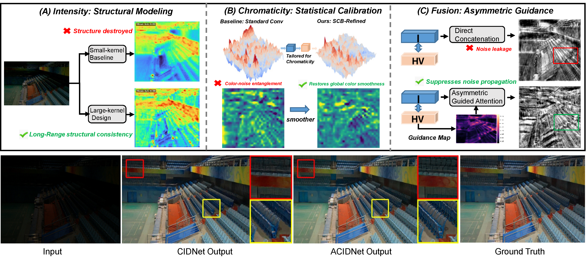

<h3 align="center">𝐀symmetric 𝐂hromaticity-𝐈ntensity 𝐃ecoupling for Low-Light Image Enhancement (ACIDNet)</h3>

<p align="center">
  <b>Pattern Recognition 2026</b>
</p>

<p align="center">
  <a href="https://doi.org/10.1016/j.patcog.2026.114139">📄 Paper</a> &nbsp;|&nbsp;
  <a href="https://pan.baidu.com/s/1ajTuReBVFxdJeix5Q0kiDA?pwd=2026">📦 Weights</a>
</p>

<p align="center">
  
</p>

## Abstract

Low-Light Image Enhancement (LLIE) aims to restore visibility and details from images captured under poor illumination conditions. Recent methods based on the Horizontal and Vertical Intensity (HVI) color space typically adopt identical architectures for both intensity and chromaticity branches, limiting their capability to simultaneously recover illumination and preserve color fidelity. To overcome these limitations, we propose the **Asymmetric Chromaticity-Intensity Decoupling Network (ACIDNet)**. The encoder adopts a specialized dual-branch structure tailored to distinct feature characteristics: the Intensity Stream utilizes large-kernel convolutions to capture global illumination priors, whereas the Chromaticity Stream employs residual modules and Statistical Context Blocks (SCB) to rectify color shifts and restore accurate color distributions. Furthermore, we incorporate a **Chromaticity-Guided Dual-Domain Attention (CGDA)** decoder. Unlike standard concatenation strategies, the CGDA decoder leverages refined chromaticity signals to adaptively modulate intensity reconstruction for improved detail recovery. Experimental results on benchmark datasets demonstrate the effectiveness of ACIDNet compared with advanced methods, particularly in achieving a favorable trade-off between computational efficiency and perceptual quality, as evidenced by its leading LPIPS performance.

---

## Installation

```bash
conda create -n acidnet python=3.9
conda activate acidnet

pip install -r requirements.txt
```

Install a PyTorch build compatible with your CUDA environment before training or evaluation.

## Pretrained Weights

**Baidu Netdisk**

* Link: [Baidu Netdisk](https://pan.baidu.com/s/1ajTuReBVFxdJeix5Q0kiDA?pwd=2026)
* Extraction Code: `2026`

## Dataset

Set the dataset root directory:

```bash
export ACIDNET_DATASET_ROOT=/path/to/datasets
```

<details>
<summary><b>Expected Directory Structure</b></summary>

```text
$ACIDNET_DATASET_ROOT/
├── LOLdataset/
│   ├── our485/
│   └── eval15/
│       ├── low/
│       └── high/
└── LOLv2/
    ├── Real_captured/
    │   ├── Train/
    │   └── Test/
    │       ├── Low/
    │       └── Normal/
    └── Synthetic/
        ├── Train/
        └── Test/
            ├── Low/
            └── Normal/
```

</details>

## Evaluation

Benchmark evaluation:

```bash
python -m eval.benchmark \
  --dataset-root "$ACIDNET_DATASET_ROOT" \
  --paired-only
```

Quick sanity check:

```bash
python -m eval.benchmark \
  --dataset-root "$ACIDNET_DATASET_ROOT" \
  --paired-only \
  --limit 1
```

Results are saved to:

```text
outputs/benchmark_metrics.json
outputs/benchmark_metrics.csv
```

### Metric Evaluation

Paired metrics:

```bash
python -m measure.paired_metrics \
  --pred-dir outputs/benchmark/LOLv2_syn \
  --gt-dir "$ACIDNET_DATASET_ROOT/LOLv2/Synthetic/Test/Normal"
```

Unpaired metrics:

```bash
python -m measure.unpaired_metrics \
  --pred-dir outputs/benchmark/DICM
```

## Training

Verify the training pipeline:

```bash
python -m train.train --dataset lol_v1 --dry_run
```

Start training:

```bash
python -m train.train --dataset lol_v1
```

Checkpoints are saved under:

```text
outputs/checkpoints/
```

## Citation

If you find this work useful in your research, please consider citing:

```bibtex
@article{hu2026acidnet,
  title   = {ACIDNet: Asymmetric Chromaticity-Intensity Decoupling for Low-Light Image Enhancement},
  author  = {Hu, Chaoya and Li, Huiying},
  journal = {Pattern Recognition},
  year    = {2026},
  pages   = {114139},
  issn    = {0031-3203},
  doi     = {10.1016/j.patcog.2026.114139}
}
```
